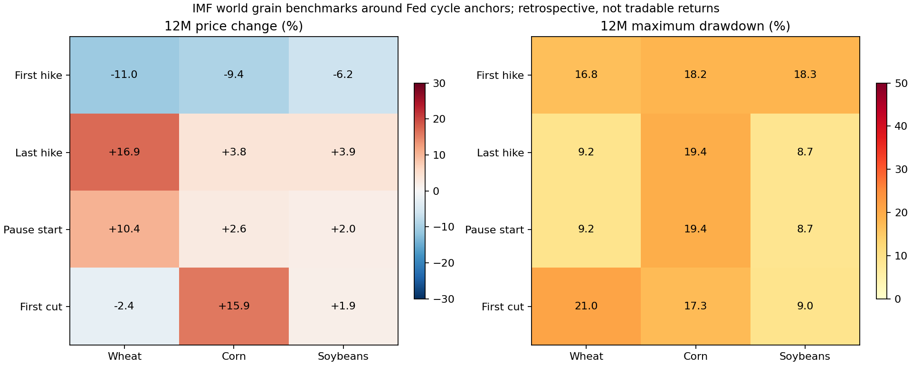

# 加息／降息周期中，能源、粮食与跨资产价格如何走？

**执行日：2026-09-27｜证据性质：历史描述，非因果、非实时预测、非可部署交易策略。** 研究方案见 [`research/COMMODITY_FED_CYCLE_PHASE_043_LOCK.md`](../../research/COMMODITY_FED_CYCLE_PHASE_043_LOCK.md)，逐事件表、分布表和图均由 [`scripts/run_commodity_fed_cycle_phase_043.py`](../../scripts/run_commodity_fed_cycle_phase_043.py) 复现。与前一轮 [042 商品至居民成本研究](../commodity_household_chain_042/中文研究报告.md) 相接，但本报告解决的是**政策周期内价格路径与投资解释**，不是新的食品传导系数。

## 先给投资判断

1. **“加息＝商品涨、降息＝商品跌”没有统一规律。** 样本内全球玉米在五轮首次加息后的第 12 个完整月全部低于事件前月，且中位跌 9.4%；但同一组大豆有 2/5 上涨，小麦有 2/5 上涨。首次降息后，玉米中位涨 15.9%，小麦中位跌 2.4%；五个周期给不出确定方向。原油的完整历史样本口径也不同，不应把粮食和 WTI 的中位数直接排名。
2. **首次降息不是股票或商品的安全信号。** 既有 004/040 样本里，S&P 500 在首次降息后 12 月中位涨 11.0%、同窗口中位最大回撤 14.0%；WTI 中位跌 16.9%、最大回撤 22.2%；纳指名义中位涨 6.0%，但对齐现金门槛的中位超额是负 3.4%。
3. **至今没有扣成本后足以实施的粮食周期交易机会。** 本次新增的是全球现货参考价格；CBOT 期货的基差、展期、合约选择、交易成本、保证金与历史逐期可得性都未验证。可把供给冲击、增长压力和债券对冲作为待检验机会卡，不能据这些表直接下单。

## 口径与时钟

冻结采用仓库 004 的四个锚点：首次加息、最后加息、暂停开始、首次降息。每轮事件月为 M0，以 M-1 月平均价格为基线，剔除 M0，观察完整 M+3、M+6、M+12。回撤在基线与 M+1 至 M+12 的月均价序列上算历史峰至后续谷。基线可能在事件公告之前较久，**不是公告当日成交价**；月均价回撤低估日内或日度风险。12 月负收益比例与 10/90 分位均为五轮中观测的离散位置，无统计置信区间意义。

1983–1988 年事件来自历史利率目标重建；粮食 1992 年才开始，因此新研究只涵盖 1994、1999、2004、2015、2022 五个宽泛周期，各期一条完整机械腿；每个资产×阶段均为 **5 腿／5 周期**。股票、黄金、原油和国债对照来自 004/035/040，样本期和价格口径**不同**。宽泛周期每个总权重相同，不能把四个高度重叠的锚点当 20 次独立试验。

最关键的时间边界：当期已公布的单次加息/降息可知，但“这一笔是**最后一次**加息”“这一段是**暂停开始**”“这次是未来宽松周期的**第一次**降息”均包含事后信息。阶段对照不能用作当时可执行的择时规则。政策利率动作也不是已识别的货币政策意外；供需冲击、增长、美元和风险偏好可能共同改变商品和政策。

## 全球粮食现货：完整样本分布

以下为名义美元/公吨 **IMF 全球现货基准价的变化**（不是期货收益），四舍五入到 0.1 个百分点。每格 `+12 月中位变化 / +12 月中位最大回撤`；括号是五轮中负的 12 月端点个数。原始行与 3/6 月指标及 10/90 分位见 CSV。

| 阶段 | 小麦 | 玉米 | 大豆 |
|---|---:|---:|---:|
| 首次加息 | -11.0% / 16.8%（3/5） | -9.4% / 18.2%（5/5） | -6.2% / 18.3%（3/5） |
| 最后加息* | +16.9% / 9.2%（2/5） | +3.8% / 19.4%（2/5） | +3.9% / 8.7%（2/5） |
| 暂停开始* | +10.4% / 9.2%（2/5） | +2.6% / 19.4%（2/5） | +2.0% / 8.7%（2/5） |
| 首次降息† | -2.4% / 21.0%（3/5） | +15.9% / 17.3%（2/5） | +1.9% / 9.0%（1/5） |

*阶段确认依赖未来。†首次降息作为周期首降也依赖后验分类。**小样本和阶段窗口重叠；表中的中位数不可相加，两个中位数未必来自同一轮。**

首次加息后完整分布的 12 月价格变化：玉米第 10/90 加权分位为 **-24.5% / -2.6%**，小麦为 **-22.2% / +3.8%**，大豆为 **-26.8% / +17.6%**。玉米“五轮都负”仅是这五轮**事后现货端点**；若观察了多个资产、四个阶段及许多潜在窗口，就不能把其中一个 5/5 当作预测检验通过。没有预先隔离的 OOS 期。

### 预设的异质性例子及最大不利波动

按事先固定的 1994、2004、2015、2022 四次首次加息，数字为 `M-1 → M+12` 价格变化 / 12 月最大回撤；余下的 **1999 年**仍在完整分布与逐笔 CSV 内。

| 首加息年份 | 小麦 | 玉米 | 大豆 | 具体启示 |
|---|---:|---:|---:|---|
| 1994 | +0.8% / 10.2% | -15.6% / 24.6% | -20.3% / 22.3% | 同阶段三品种不同向；年末盈利不等于途中稳定。 |
| 2004 | -14.5% / 16.8% | -24.5% / 27.7% | -26.8% / 44.4% | 同跌仍伴随显著峰谷风险。 |
| 2015 | -22.2% / 25.6% | -8.0% / 17.5% | +17.6% / 15.5% | 大豆方向与另两种相反。 |
| 2022 | -11.0% / 30.3% | -2.6% / 18.2% | -6.2% / 18.3% | 玉米一度相对基线最高 +19.1%，最终 -2.6%；逆势冲击会使做空路径极不稳定。 |

例：2022 年玉米 IMF 月价在事件前的 2022-02 为 **292.67 美元/吨**，2023-03 为 **284.96 美元/吨**，因此 `284.96/292.67 − 1 ≈ -2.64%`，与脚本逐笔记录相符。俄罗斯入侵、货币收紧、需求、物流与汇率等同时发生；这些数值**不识别**各自贡献。[IMF/FRED 玉米原表](https://fred.stlouisfed.org/data/PMAIZMTUSDM)。

## 其他资产：把机会成本和路径风险一起看

下表从既有 004/035/040 的同一阶段框架读取：`+12 月名义月均价/代理回报中位数；括号内为 12 月 MDD 中位数`。**各资产样本期不同**；S&P、纳指、WTI 为价格而非含股息/展期的可投资总收益；VUSTX 是长国债基金**历史代理**，不等于当前 TLT 或持有十年国债。DXY 指数也不等于无成本美元交易。现金相对值在下文单列，不要从两个表中位数相减。

| 阶段 | WTI | S&P 500 | 纳指 | 黄金 | 长国债代理 VUSTX | DXY |
|---|---:|---:|---:|---:|---:|---:|
| 首次加息 | +22.4% (18.8%) | +8.0% (5.9%) | +6.5% (12.2%) | +3.1% (11.6%) | +1.0% (10.7%) | +3.0% (8.2%) |
| 最后加息* | +5.0% (19.6%) | +16.7% (4.2%) | +15.6% (4.0%) | -2.8% (9.1%) | +9.9% (3.3%) | -1.3% (5.2%) |
| 暂停开始* | -4.6% (18.0%) | +24.6% (4.2%) | +28.1% (4.0%) | +4.9% (7.6%) | +15.1% (3.9%) | -1.3% (6.3%) |
| 首次降息† | -16.9% (22.2%) | +11.0% (14.0%) | +6.0% (17.5%) | +4.1% (5.4%) | +6.0% (4.5%) | -1.3% (5.2%) |

004 核心样本通常是股票/黄金 10 腿／7 宽泛周期，WTI 8／6；VUSTX 8／6；暂停阶段少于这些。既有 040 在**事件配对后**估算的现金相对中位值，首次加息阶段：WTI **+17.8%**、S&P **+2.5%**、纳指 **-0.8%**、黄金 **-2.4%**、VUSTX **-3.6%**；首次降息阶段：WTI **-24.3%**、S&P **+2.1%**、纳指 **-3.4%**、黄金约 **-0.05%**、VUSTX **+1.8%**。这些是历史配对结果，不能据此把阶段排列为买卖表。040 全 232 个资产事件中，136 个名义正收益端点有 30 个不及配对现金；041 还显示 3、6、12 月的现金相对结论可以翻转。

解释上，**供给受限、强需求、美元与加息可以同现**；加息本身不“推高”原油。首次降息常见于增长风险上升，也可能是温和正常化，股票、债券、商品的条件分布因此交叠。政策对预期、实际利率和美元的作用，还须区分市场原先预期与政策意外；本数据只是政策行动周围的历史路径。

## 三张有边界的机会卡

| 待检验机会 | 当时能观察的触发与确认 | 失效与退出逻辑 | 证据等级和下一步 |
|---|---|---|---|
| 供给型粮价冲击及其受益／受损链 | 在 USDA WASDE、作物进度/季度库存、CFTC 和交易所报价的**正式发布时间之后**，检查预估产量/库存下修、近月相对远月走强，及豆粕/豆油、玉米乙醇和终端食品是否确认；再比较上游企业、食品企业与通胀补偿。 | 库存上修或物流恢复、价差与下游背离、期限结构由紧转松；风险预算/时间窗触发则退出；不可把加工价差混作同一种利润。 | **研究假说**。须获取合约/展期和逐期修订、验证流动性/滑点/保证金、与现金/持有/仓库基准做滚动 OOS，并对同族多重检验调整。 |
| 首降息与原油下跌的增长风险 | 首降息**公告后**，同时查看增长数据、EIA 库存和炼厂运行、油品裂解价差及曲线，分辨需求走弱与供给冲击；只在多数据一致时列风险观察。 | 原油因供给断裂而持续涨、需求超预期、曲线与库存不支持需求减弱，立即撤销该解释。 | **风险提示／研究假说**。WTI 首降息历史中位 -16.9% 不是期货空头净收益；首次这一周期身份也有后验偏误。 |
| 股票风险与长久期债券对冲 | 依据实时风险敞口及已发布的利率/通胀与增长信息测算久期敏感度，比较现金、短债、长债与对冲后的组合路径。 | 通胀再加速、长端期限溢价抬升、股债同跌或相关性转正、对冲成本超过缓冲效益时减少/取消对冲。 | **条件式组合研究**。VUSTX 是历史代理且有债券久期回撤；需按实际可交易基金、配对现金及再平衡费验证净效果。 |

这些卡没有拟合过触发阈值，故没有任何“买入价／卖出价／权重建议”。尤其不能因为“玉米 5/5 下跌”就做空期货：美国交割点与全球基准不同，月均价不是可成交价，卖空途中的保证金风险和 2022 年 +19.1% 上行冲击没有被 12 月终点抹去。

## 当前观察与旧研究的连接

本次冻结的粮食三项最新月均观测仍为 **2026-07**，FRED 标明 **2026-08-17** 更新；截至 **2026-09-27** 不用它们描述九月即时行情。政策动作与最新公开信息应从[美联储公开市场操作历史](https://www.federalreserve.gov/monetarypolicy/openmarket.htm)（页面截至 2026-09-16）、[EIA 周报](https://www.eia.gov/petroleum/supply/weekly/)、[USDA WASDE](https://www.usda.gov/oce/commodity/wasde)、[USDA Crop Progress](https://www.nass.usda.gov/Publications/National_Crop_Progress/)、[CFTC 持仓](https://www.cftc.gov/MarketReports/CommitmentsofTraders/index.htm)分别核对发布日期，且使用已发布版本。042 的最新观察表应按各来源更新时间使用，不把它直接移植为“今日信号”。

把事实和判断分开：**已发生**是历史 IMF 三项 1992-01 至 2026-07 资料、五个完整政策周期及仓库既有其他资产历史分布；**可能发生**是新供需冲击影响食品或资产风险溢价；**足以改变判断**需实时库存/产量/零售价与期限结构给出相反的同步证据，并通过事先固定的样本外、净成本门槛。

## 来源、质量检查及限制

主要原始资料：[IMF/FRED 全球小麦](https://fred.stlouisfed.org/series/PWHEAMTUSDM)、[玉米](https://fred.stlouisfed.org/series/PMAIZMTUSDM)、[大豆](https://fred.stlouisfed.org/series/PSOYBUSDM)，月度未季调、美元/公吨，数据表最后更新 2026-08-17，执行日 2026-09-27 下载，原始下载哈希在 QC 文件，版权归 IMF，引用须标明出处、原始数据未随仓库再分发。事件日期是仓库既有 [004 冻结注册表](../../research/FED_CYCLE_PHASE_CLOCK_004_LOCK.md) 和 [美联储利率历史](https://www.federalreserve.gov/monetarypolicy/openmarket.htm)；1994 与 2004 年的当时通讯及历史披露差异见[美联储 FEDS Notes，2015-09-24](https://www.federalreserve.gov/econresdata/notes/feds-notes/2015/effects-of-fomc-communications-before-policy-tightening-in-1994-and-2004-20150924.html)。对照资产口径和来源见仓库 [004 报告](../fed_cycle_phase_clock_v1/FED_CYCLE_PHASE_CLOCK_004_REPORT.md)、[032 图谱](../fed_cycle_four_phase_investor_atlas_032_v1/FED_CYCLE_FOUR_PHASE_INVESTOR_ATLAS_032_REPORT.md)、[035 代理桥](../../research/FED_CYCLE_LONG_TREASURY_PROXY_BRIDGE_035_CLOSEOUT.md)及 [040 报告](../fed_cycle_cash_hurdle_real_return_map_040_v1/FED_CYCLE_CASH_HURDLE_REAL_RETURN_MAP_040_REPORT.md)。

检查：3×415 条连续正值月观测；60 条粮食事件、12 个四阶段品种格，全部 5 腿／5 宽泛周期、权重和为 5；各事件完整端点；2022 玉米一笔以 FRED 原表独立手算；不改写旧 004/040 数据；负例不删除。**通过描述性质量检查**。风险：只有五个独立宽泛周期、价格历史为当前版本（非 ALFRED 当时版本），存在事件窗口重叠、政策内生性、商品定义与实际可投资工具不一致、未测期货展期和净成本、未做 OOS/多重检验；不能声称预测或套利能力。
