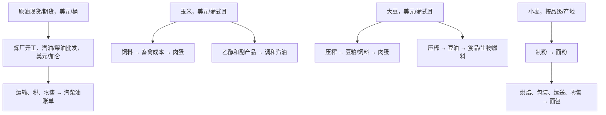

# 042｜从油田和农场到加油站、超市，再到美联储与资产

**执行日：2026-09-27（悉尼）；美国市场可见资料截至 9 月 25 日前各来源最近一次发布。证据等级：机制与描述性证据通过来源及计算 QC；商品预测、政策预测和扣费交易机会均未证实。** 本文是美国价格链研究，不把美国消费者价格等同于澳洲家庭价格或将美国期货直接等同于你账户里的现货黄金。

## 先读最有用的判断

汽油通常直接反映油品批发价格；面包则包含农场以外的加工、工资、运输和零售成本，反应时点与幅度均不同。**2026 年 8 月，美国农场小麦价格同比 +35.1%，同期全国白面包平均价从 2025 年 8 月 $1.841/磅到 $1.823/磅，约 −0.98%**。这是两个不同统计对象的并列描述，不能推断当月小麦涨价对面包没有长期影响。USDA 还预计 2026 年谷物与烘焙品零售价涨幅低于历史平均；不要把 WASDE 中农业年度预测当作可交易期货现价。来源：[ERS 2026-09-25](https://www.ers.usda.gov/data-products/food-price-outlook/summary-findings)、[BLS 平均价格表，2026-09-11 更新的 8 月数据](https://www.bls.gov/charts/consumer-price-index/consumer-price-index-average-price-data.htm)。

### 主席究竟说了什么

官方 [2026-09-16 记者会逐字稿](https://www.federalreserve.gov/mediacenter/files/FOMCpresconf20260916.pdf)：第 **4 页**，记者问加息无法重开霍尔木兹海峡，主席回答美联储无法改变某种油价或超市商品的单价，职责是防止相对价格变化扩散成二、三轮通胀。第 **5 页**，他拒绝预判接下来的利率行动。第 **12 页**，在回答“为何近期长期债券收益率上升”时，列举经济增长、资本需求和地缘政治，并提及能源以及玉米、大豆、小麦现货与下游进入商店的产品价差。第 **3 页**则说关注通胀补偿和预期是否锚定。第 12 页那句中的 *crack spreads* 对油品有标准炼油含义；将它延展到粮食是口语化表述，**不能据此把压榨、乙醇、制粉利润当作同一种炼油裂解价差**。链条观察 → 识别价格扩散 → 推断政策 → 交易盈利，每往下一步都需要额外证据；讲话只支持前两步的关注理由。

## 四条机制链（分开报价、日期、单位）

油品 *crack spread* 是同品种、地点、时点和单位对齐的成品油减原油价值的**炼油毛利代理**，不是净利润。大豆 *crush margin* 要按豆粕与豆油出率和投入豆成本换算；玉米乙醇链要计入乙醇、DDGS 等副产品、天然气和加工；小麦到面粉是按出粉率、副产品及面粉级别计算的加工价差。不能用“粮食 − 原油”或四个未经换算的差额作横向排名。[EIA 对 crack 的定义](https://www.eia.gov/todayinenergy/detail.php?id=68164)、[WASDE 玉米乙醇与大豆产品口径](https://www.usda.gov/oce/commodity/wasde/wasde0926.pdf)。

**传导幅度和时滞：**EIA 2026 年 5 月汽油泵价 $4.479/加仑的成本拆分为原油 51.9%、炼油 21.7%、分销和营销 14.8%、税 11.5%（四舍五入合计 99.9%）；这是当月**成本份额**，不是油价上涨 1% 会带来汽油上涨 0.519% 的因果弹性。[EIA 泵价拆分，页面发布 2026-09-22](https://www.eia.gov/petroleum/gasdiesel/gaspump_hist.php)。USDA 既有 1972–2008 模型发现，2000–08 年农场小麦变动向批发面粉传递约 30%，批发面粉向零售面包约 16–21%，两段的统计基准不同，不能机械连乘为今天的预测系数；小麦→面粉的大部分响应约在 1 个月，面粉跌或温和涨时面包主要在 2–4 个月响应，而面粉急涨时可能更快。[ERS 原研究概述，2011-06-16](https://www.ers.usda.gov/amber-waves/2011/june/food-commodity-cost-pass-through)、[ERS 2014 综述](https://www.ers.usda.gov/amber-waves/2014/may/food-price-transmissions-from-farm-to-retail)。本轮**没有重新估计 2026 玉米/大豆/小麦的链条弹性**。

2024 年 ERS 修订口径中，平均每 $1 美国国内生产食品消费额只有 **11.8 美分为农场份额**，88.2 美分属于农场后加工、运输、销售等营销份额。这是**全食品加权份额**，不是某一条面包链的份额或价格传递率。[ERS，2026-04 发布的 2024 数据](https://www.ers.usda.gov/data-products/charts-of-note/114074)。农期上涨不会自动等于全超市食品同比上涨，还因合约预期已经计价、库存缓冲、天气与生物燃料/出口需求、合同锁价、汇率、品类权重和同比基期。

## 历史价格路径与失败案例

**预先选 2008（高油价后需求崩塌）、2020（疫情需求骤降）、2022（俄乌战争及多重供需冲击）。** 表中 WTI 是 Cushing **每日现货的月均**，另两项是 BLS 美国全国月平均标价；三者都不是期货连续合约，也没有按事件公告日模拟进场。年内最大回撤是各月运行峰值到后续谷值；年后“回到 1 月价”是**首次月度观测重新达到 1 月水平**，不是重新达到峰值。数据来自 [FRED/EIA DCOILWTICO 下载](https://fred.stlouisfed.org/graph/fredgraph.csv?id=DCOILWTICO) 与 [BLS 官方逐月平均价表](https://www.bls.gov/charts/consumer-price-index/consumer-price-index-average-price-data.htm)。

| 年份 | WTI 1月→12月；年内回撤；回到1月价 | 汽油 1月→12月；年内回撤；回到1月价 | 白面包 1月→12月；年内回撤 |
|---|---|---|---|
| 2008 | −55.77%；−69.28%；2011-03 | −44.57%；−58.70%；2011-01 | **+10.46%**；−1.15% |
| 2020 | −18.24%；−71.23%；2021-02 | −15.54%；−26.92%；2021-03 | **+13.84%**；−0.20% |
| 2022 | −8.15%；−33.44%；2023-09 | −1.67%；−33.65%；2023-01 | **+20.45%**；−0.40% |

这些不是“在战争公告后做空/做多”的收益：2022 年 WTI 年内曾达 **较 1 月 +37.99%**、汽油 **+48.20%**，最终 12 月反而低于 1 月。把年末跌幅当作当时可捕捉的利润有严重前视问题。2020 年 WTI 曾出现单日负报价，本表月均会掩盖该极端日。2022 年食品价也受能源、禽流感和其他通胀力量共同作用，不能归因为小麦一种冲击。[ERS 2026-09 食品回顾](https://www.ers.usda.gov/data-products/food-price-outlook/summary-findings)。

**完整共享样本（2007–2024，18 个完整自然年）**：1→12 月涨跌的中位数 / 第 10–90 百分位依次为 WTI −1.23% / −26.94% 至 +65.26%，汽油 −1.84% / −17.74% 至 +36.92%，白面包 +1.14% / −3.74% 至 +11.86%。18 年中负年比例分别 50%、56%、33%。2025 年白面包 10 月缺失，2026 年尚未完结，均未补值进入完整年分布。年份有共同宏观冲击和长期趋势，**不能当独立随机试验**。可复现表、原始下载 SHA256、脚本与图在本目录。[价格路径图](CASE_YEAR_PRICE_PATHS.png)。

**补充谷物现货背景（同三年份，同 1→12 月口径；单位 USD/公吨的 IMF 全球基准月均，非 CBOT 合约）：**

| 年份 | 全球小麦全年变化 / 最高较1月 | 全球玉米全年变化 / 最高较1月 | 全球大豆全年变化 / 最高较1月 | 对照解释 |
|---|---:|---:|---:|---|
| 2008 | −43.82% / +20.14%（3月峰） | −23.07% / +39.01%（6月峰） | −30.95% / +20.02%（7月峰） | 峰值后大跌，不能用年末回看当时能否及时出场。|
| 2020 | +21.92% / +21.92% | +15.93% / +15.93% | +31.62% / +31.62% | WTI 同期下跌，跨商品不是同一个“通胀交易”。|
| 2022 | −0.74% / +36.21%（5月峰） | +9.22% / +25.94%（4月峰） | +5.32% / +20.75%（6月峰） | 小麦年末接近 1 月价，但面包年末仍较 1 月高 20.45%。|

**18 个完整年份的谷物分布**（2007–2024）：Jan→Dec 中位 / P10–P90：小麦 −6.62% / −26.24% 至 +44.38%；玉米 −1.21% / −25.60% 至 +14.69%；大豆 −5.98% / −20.26% 至 +32.56%。这是事后描述；IMF/FRED 的全球出口基准与美国内陆现金价、食品厂投入和可交易期货并不匹配，也没有归因 2022 价格变化的各类冲击。来源及口径：[IMF/FRED 小麦](https://fred.stlouisfed.org/series/PWHEAMTUSDM)、[玉米](https://fred.stlouisfed.org/series/PMAIZMTUSDM)、[大豆](https://fred.stlouisfed.org/series/PSOYBUSDM)；[谷物图](IMF_GRAIN_CASE_PATHS.png)、[派生年度统计](IMF_GRAIN_ANNUAL_DERIVED.csv)。FRED 标注 IMF 数据需署名及版权，仓库不包含原始月序列。

## 现货、期货与发布日期：观察卡

| 变量 | 当时可观察信息与口径 | 易犯的时间/交易错误 |
|---|---|---|
| 油现货、产品现货与炼油 | EIA 9/24 收盘 WTI $95.88/桶、Brent $120.92/桶、NYH RBOB $3.67/加仑、Gulf Coast LLS 口径 3:2:1 crack $70.13/桶；该页面**能源期货栏为 NA**。来源：[EIA Daily Prices](https://www.eia.gov/todayinenergy/prices.php) | Brent/WTI/LLS、NYH/Gulf Coast、现货/期货不匹配；不可用周一泵价减周四批发价充作净加工利润。|
| 美国零售汽柴油 | EIA 9/21 观察汽油 $4.478、柴油 $6.529/加仑；9/22 公布，下一次 9/29。[EIA 汽柴油](https://www.eia.gov/petroleum/gasdiesel/) | 不等同 BLS 8 月 CPI 平均汽油价；税与州别差异巨大。|
| 石油库存、炼厂与需求代理 | EIA 9/23 发布 9/18 周数据：原油商业库存 426.4 百万桶，汽油 206.0，馏分油 107.4；4 周炼厂利用率 96.6%，汽油表观供应 8.779 百万桶/日。[WPSR 表格](https://www.eia.gov/petroleum/supply/weekly/pdf/highlights.pdf) | 先记录**9/23 发布时间**，不能把 9/18 周末数提前用于周一交易；摘要首段与表格周别不一致，以标明 9/18 的表为准，归档版本需另存。|
| 小麦、玉米、大豆供需预估 | 9/11 WASDE：美国 2026/27 小麦季均**预测** $6.40/蒲；玉米产量预测 15.800 十亿蒲（比 8 月下修 213 百万），库存预测 1.567 十亿蒲；大豆库存预测 310 百万蒲，豆粕 $340/短吨、豆油 $0.70/磅均为**季均预测**。[WASDE-675](https://www.usda.gov/oce/commodity/wasde/wasde0926.pdf) | 预测会修订，季均农场价不是即时报价；小麦全球库存本次**上修**，美国品类也有分化。|
| 全球谷物月均基准 | IMF 经 FRED 公布的**最新仅 2026-07**：小麦 $228.73884、玉米 $213.19015、大豆 $442.45057/公吨；网页显示 2026-08-17 更新。[小麦](https://fred.stlouisfed.org/series/PWHEAMTUSDM)、[玉米](https://fred.stlouisfed.org/series/PMAIZMTUSDM)、[大豆](https://fred.stlouisfed.org/series/PSOYBUSDM) | 不是 9/27 即时现货或 CBOT 主力合约，不可把这组滞后的月均价与 9/11 WASDE 预测相减算超额收益。|
| 作物、库存及持仓 | 9/21 16:00 ET Crop Progress 已公布；9/28 下一份尚未公布，9/30 Grain Stocks 仍待发布。[NASS 日历](https://www.nass.usda.gov/Publications/Calendar/reports_by_date.php?month=09&view=l&year=2026)。CFTC 周二持仓周五 15:30 ET 才发布。[CFTC 规则](https://www.cftc.gov/MarketReports/CommitmentsofTraders/AbouttheCOTReports/cot_about.html) | 把周二持仓在周三用于信号属前视；本轮未取得逐合约净持仓的经核对数字，**留空**。|
| 家庭通胀与政策 | BLS 9/11 公布 8 月汽油 CPI 环比 SA +3.9%、同比 NSA +27.4%；食品居家环比 SA 0、同比 NSA +2.2%；9 月 CPI 要 10/14 才发。[BLS 8 月发布](https://www.bls.gov/news.release/archives/cpi_09112026.htm)。9/16 联储加息 25bp 至 3.75–4.00%。[联储逐字稿](https://www.federalreserve.gov/mediacenter/files/FOMCpresconf20260916.pdf) | 月度 CPI 落后现货，政策同时看增长、广泛通胀和预期；讲话没有给下次加息承诺。|
| 市场利率、通胀补偿、美元 | 本轮重新下载 FRED：2Y 国债 9/24 **4.87%**、10Y **5.18%**、10Y TIPS 实质收益率 **2.85%**；5Y breakeven 9/25 **2.34%**；美元广义贸易加权指数仅更新到 9/18 **119.5133**。原始序列：[DGS2](https://fred.stlouisfed.org/series/DGS2)、[DGS10](https://fred.stlouisfed.org/series/DGS10)、[DFII10](https://fred.stlouisfed.org/series/DFII10)、[T5YIE](https://fred.stlouisfed.org/series/T5YIE)、[DTWEXBGS](https://fred.stlouisfed.org/series/DTWEXBGS) | 不同最后观测日不可作精确同日收益拆解；breakeven 含风险/流动性溢价，并非消费者调查预期或纯政策冲击。|

**本次关键缺口：**尚无同一合约月与交割地匹配的谷物现货基差、完整期货曲线及换月簿、可执行 bid/ask、保证金与资金成本、当时 USDA 修订版本和时点、相关股票总收益及通胀预期和实际利率的同步事件窗口。普通 CBOT 玉米/大豆合约各 5,000 蒲，微型为 500 蒲；合约不同、有实物交割与换月风险，不能从现货图直接推算期货收益。[CME 玉米](https://www.cmegroup.com/markets/agriculture/grains/corn/specs)、[CME 大豆](https://www.cmegroup.com/markets/agriculture/oilseeds/soybean/specs)、[CME 微型](https://www.cmegroup.com/markets/agriculture/micro-ag-futures)。

## 条件式机会卡（全部为研究假说，零已验证净收益）

| 假说与可用对象 | 提前登记的触发→确认 | 失效、退出及比较基准 | 当前等级 |
|---|---|---|---|
| H1 产品端油品紧张；原油/汽柴油期货、炼化股、运输股 | 同地点同日柴油或汽油 crack 扩大，下一份 EIA 产品库存与炼厂/净出口一致；区分价格上涨由供给损失还是终端需求增长 | 若产品库存回补且价差收缩连续两次发布，或者宏观需求急降则失效；最大持有 4、8 周分别报告。与持有期货、现金和仓库 004/005 风险状态比较，报告双边交易成本、roll、股息与冲击。**仓库现有能源 0/4 BH-FDR，禁作做空信号。** | 机制观察；OOS/扣费未做 |
| H2 作物供给修订超预期；指定交割月玉米/豆/麦、农企及食品企业 | 作物进度异常 + WASDE 产量/库存修订 + 现货基差/近远月价差同向（等报告发布后确认）；按芝加哥小麦与其他麦类分开 | 若库存修订逆转、基差不确认或流动性/保证金不达门槛则撤销；预先固定 1、3 个月窗口；与期限匹配现货持有、现金及同业指数比较 | 尚缺 PIT 曲线和共识预期；只是假说 |
| H3 需求毁损下商品降温；债券、通胀补偿、美元、黄金和组合对冲 | 同时有产品销量/作物需求指标走弱与广泛通胀放缓；分别测实质收益率、风险溢价和美元，政策意外必须另识别 | 若供应中断扩大或核心通胀/工资再加速则失效；固定事件窗和 1、3、6 个月期。跨资产与现金、已有 Fed-cycle 风险路径比较 | 混杂严重；不能据“油跌”单押降息 |

所有假说未来必须按**信息发布后下一可交易价格**进入，采用时间顺序训练/测试、统一成本和交易量、最大不利波动及回撤；一口气申报资产×期限检验族并做 BH-FDR 10%，不得挑赢家后改窗口。方向收益是否超过现金、简单持有和仓库基准是不同检验。当前**没有合格的期货、股票、利率或美元实际择时点**。文献关于汽油和食品容易影响家庭通胀感受的结论，只支持监测预期渠道；其强度、期限与货币政策冲击须另测。[联储关于家庭价格注意力](https://www.federalreserve.gov/econresdata/notes/feds-notes/2016/limited-attention-and-inflation-expectations-of-households-20161019.html)。

## 三段式实时结论

- **已发生：**9/16 加息；9/11 CPI 中汽油涨、超市食品环比持平；9/11 WASDE 玉米收成/库存下修，大豆库存下修，全球小麦库存上修；9/21 泵价汽油和柴油上行；9/24 EIA 产品现货和炼油价差仍高。[来源分别见上表。]
- **可能发生：**油品供应紧张可能先体现在柴油批发和运输成本，粮食供给下修可能先改变期货与局部现金基差；家庭通胀预期的持续性和政策反应方向**尚不确定**。
- **足以改变判断的条件：**未来至少两份 EIA 中产品库存、炼厂与表观需求连续向宽松方向一致变化；9/28 以后 Crop Progress 与 9/30 Grain Stocks、10/9 WASDE（待核发布）证实或反驳农产品紧缺；10/14 CPI 显示食品与非能源核心项是否广泛扩散；匹配期限的通胀补偿和利率在公告窗出现可归因的重新定价。逐项保留发布时间，回看时不能把后来修订填回早期可见表。

## 质量与论文防火墙

脚本通过公开 BLS 和 FRED/EIA 下载的 SHA256、日期唯一性、18 年 54 个完整年×价格序列 QC；图表为描述性。无因果识别，无完整事件期货曲线，无通胀预期、股债美元的匹配事件收益，无 OOS、FDR 或扣费回测。EIA 9/24 网页快照和 USDA 9/11 WASDE 为**执行日截面**，不当成永久最新；公开仓库未引入任何私有论文的员工预测、会议级反应面板或未发表回归。下一里程碑先归档按发布时点的 USDA 预测修订与谷物本地现货/合约面板，再估计四条链的时滞与幅度。
