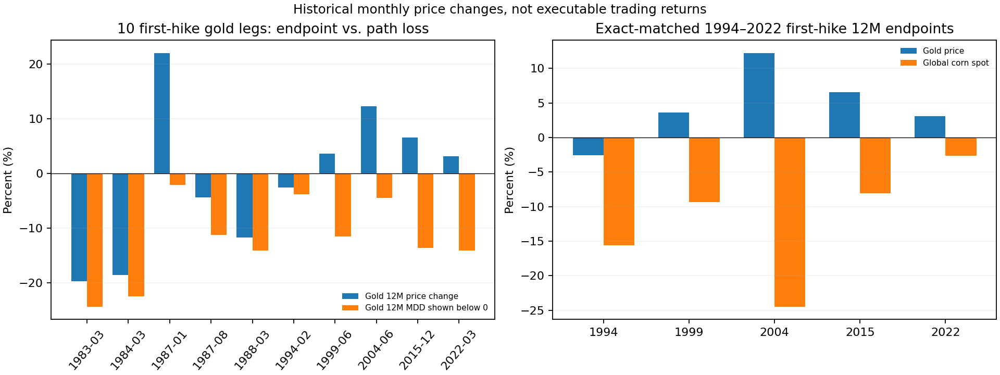

# 黄金没有明显下跌吗？玉米 5/5 是什么？下一次事件怎样等待？

执行日：**2026-09-27，悉尼**。状态：**QA PASS / 描述性、决策流程；无已验证净收益交易策略**。依据 [`044 冻结设计`](../../research/GOLD_COMMODITY_EVENT_WAIT_044_LOCK.md) 复用公开仓库 004/008/009/011/040/043；新计算由 [`044 复现脚本`](../../scripts/run_gold_commodity_event_wait_044.py) 产生。未接触私有论文。

## 先把图和四种数字分开

| 指标 | 黄金在首次加息后 | 解释 |
|---|---:|---|
| 名义价格变化，M-1 至 M+12 的宽泛周期加权中位数 | **+3.1%** | 与事件同时的历史价格变化，不含实际成交成本。10 个机械加息段、7 个宽泛周期。 |
| 同一 12 个月内的月均价最大峰谷回撤的加权中位数 | **11.6%** | 有涨的终点仍可能途中显著回撤；10 段中最深一笔月均回撤 **24.4%**（1983）。日内风险可能更大。 |
| 价格涨幅扣事件配对的 CPI 后的实际回报中位数 | **约 −2.8%** | 040 的通胀事后口径，是购买力，不是回撤。 |
| 逐事件配对现金门槛的超额中位数 | **约 −2.4%** | 名义涨价并不保证比持有现金好；不能拿两个单独中位数相减。 |

你截图中**“最后加息”行的黄金 −2.8%**是另一项：最后加息后 12 月的**名义价格变化中位数**，该行括号 **9.1%** 才是最大回撤中位数。一个数值接近首次加息的实际收益率，但不是同一个统计量。黄金首次加息 10 个机械段里有 **5 个名义端点为负**；按宽泛周期加权后负值份额 **38.1%**，因为 1980 年代有多条腿被归到同一宽泛周期。不能得出“加息时黄金不会明显下跌”。

按冻结的当前样本路径，逐笔黄金首次加息结果完整见 [004 原表](../fed_cycle_phase_clock_v1/PHASE_CYCLE_ASSET_METRICS.csv)；例如 1983 年 12 月端点 **−19.8%**／MDD **24.4%**，1984 年 **−18.7%**／**22.5%**，2022 年 **+3.1%**／**14.1%**。这三笔风险不能由 +3.1% 的加权中位数抹去。004 用月均价，非黄金 CFD 的可成交价，也不能推导出 M1 止损美元数。

## 玉米“五轮全跌”的严格定义与交叉例子

043 的五个宽泛首次加息周期：**1994、1999、2004、2015、2022**。每次以加息发生月前一个月的 IMF 全球玉米**月均价**作基线，忽略事件月，到事件后第 12 个完整月的月均价再比较。五个终点依次为 **−15.6%、−9.4%、−24.5%、−8.0%、−2.6%**；因此是**5/5 终点为负**，不是政策周期内每次加息都跌、每个月都跌、美国玉米期货 5/5 空头盈利，也没有样本外交易胜率。数据截至 2026-07，IMF 月度基准价的 FRED 页面最后更新 2026-08-17。 [全球玉米原表](https://fred.stlouisfed.org/data/PMAIZMTUSDM)。

将**同五次首次加息**黄金和玉米精确按事件对齐，新生成逐笔表（百分比，`终点变化 / 月度 MDD`）：

| 首加息 | 黄金 | 全球玉米 | 为什么不能机械配对交易 |
|---|---:|---:|---|
| 1994 | −2.6 / 3.8 | −15.6 / 24.6 | 黄金与玉米同跌。 |
| 1999 | +3.6 / 11.6 | −9.4 / 12.0 | 黄金涨但途中回撤。 |
| 2004 | +12.2 / 4.5 | −24.5 / 27.7 | 与 1994 的黄金方向相反。 |
| 2015 | +6.5 / 13.7 | −8.0 / 17.5 | 黄金涨幅没有消除路径风险。 |
| 2022 | +3.1 / 14.1 | −2.6 / 18.2 | 玉米月均价相对基线曾最高 +19.1%，期货空单面临更大现实路径风险。 |

五次中黄金正／玉米负为 **4/5**，但这是只从 1994 年有粮食价格以来重叠的五轮**事后描述**；不识别对冲收益，不能作为“买黄金、空玉米”的证据。逐笔源：[匹配 CSV](MATCHED_GOLD_CORN_FIRST_HIKE.csv)、[QC](QC.json)。

## 当时可做的事：把时间、数据和否决条件绑在一起

以下是**事件观察卡**。`等待 → 候选 → 背景确认／否决 → 单独做净收益检验`；卡里的“确认”仅表示经济解释获得更多公开证据，**不是交易回测通过**。原先五轮的 LAST_HIKE／PAUSE_START 是后验标签，不用作实时触发。

| 观察卡／官方时钟（ET；悉尼 AEST） | 当时可观察的触发／需要保存的基线 | 下一步确认与失效 | 当前证据等级 |
|---|---|---|---|
| **农产品库存与种植进度**：NASS Crop Progress 定于 **9/28 16:00 ET＝9/29 06:00 悉尼**；Grain Stocks 与 Small Grains Summary 定于 **9/30 12:00 ET＝10/1 02:00 悉尼**。 | 报告发布前保存上一份 USDA 估计及**有时间戳的市场预期**；发布后分别看玉米／大豆库存、小麦产量和修订，再看对应 CBOT 品种的近远月、成交量及现货基差。没有会前预期就只记录数据变化，不称“超预期”。 | 库存/产量紧张与近月走强一致，才保留**供给紧张候选**；若库存上修、期限结构松动或下游不配合，否决。单次作物进度变化不足以证明全季减产。必须再检查不同交割点、单位、季节和换月。 | **研究假说；无净期货检验**。NASS 2026-09 发布日历为官方时间源；043 只有全球现货历史。 |
| **石油物理链**：EIA WPSR 通常周三，**9/30 10:30 ET＝10/1 00:30 悉尼**；官方 009 的 9/23 事件仍是 `TIGHT_OR_MIXED`，截至 9/27 首个后续发布尚未发生。 | 新 WPSR 发布后，严格用前一日已知价格与发布日新库存、成品油供给、炼厂利用率；不得用报告对应的上周五日期假装周五已知。 | 009 规定同一类 `DEMAND_DESTRUCTION` 或 `SUPPLY_NORMALIZATION` **连续两次**新周报才是 `CONFIRMED_CONTEXT`；第一份只有候选。若仍混杂或数据不齐，继续等待，且供给冲击/海运压力可否决“宽松”解释。 | **观察流程，不是空油信号**：004 严格 PIT 共 17 事件，SUPPLY_NORMALIZATION 仅 1，四项主检验 0/4 有支持；011 的 10 次 mixed 仅 2 次在四份后续周报内达两次确认。 |
| **黄金宏观链**：FOMC 或官方 CPI/PCE 发布后的时点。 | 公布前保存利率市场预期、事件前黄金和美元价、10 年 TIPS 实际收益率、通胀补偿等；公布后分开记录政策决定、**相对预期的变化**和黄金路径。不能把“加息”两字视为政策意外。 | 实际利率下降且美元走弱、黄金现货/可成交报价配合，构成研究候选；实际利率反升、美元走强或流动性冲击占主导则否决简单利率解释。黄金安全需求与央行购金仍是竞争机制。 | **仅初步预测信息**：仓库 008 时间顺序 OOS 四个后续宽泛周期，实时 IPT 特征相对 B2 的等权 MSE 降 21.3%，对最简单 B0 的 OOS R² 仅 +0.034；不是已经检验收益的交易模型。 |
| **CFTC 持仓**：周二头寸通常**周五 15:30 ET**发布；9/29 周二的数据若照常发布，要到 **10/2 15:30 ET＝10/3 05:30 悉尼**才可用。 | 保存发布时刻；用它核对拥挤度及是否有换月/口径改变，不在 USDA 发布当夜引用尚未公布的 9/29 数据。 | 持仓很拥挤且价格/期限结构反向，视为情景否决或降低信心；绝不把历史公布日晚于交易日的数据前填。 | **辅助背景**；未经验证的单独择时指标。 |

NASS 官方[2026 年 9 月发布日历](https://www.nass.usda.gov/Publications/Calendar/reports_by_date.php?month=09&view=l&year=2026) 9/27 显示上述事件为 `Report Pending`；[EIA 周报时间表](https://www.eia.gov/petroleum/supply/weekly/schedule.php)为常规周三 10:30 ET，节假日有例外；[CFTC 说明](https://www.cftc.gov/MarketReports/CommitmentsofTraders/AbouttheCOTReports/index.htm)明确周二头寸周五 15:30 ET 公布。悉尼 9/29—10/3 尚未开始夏令时，ET 当期为 EDT，相差 **14 小时**；若报告变更，重新核对官方实际时间。

## 真正能让候选升级为“机会”的门槛

1. **拿到当时可得的合约数据与预期快照。** 分别用 CBOT 小麦、玉米、大豆和对应 COMEX/WTI 商品的真实可交易工具，固定合约月份、换月、交割点、日内发布与可成交价；保存 USDA/EIA/CFTC 公布时刻。不能用后来修订的库存或现货月均价填回当时。
2. **冻结一个可证伪的交易定义再跑历史。** 公布之后最早可成交时点、确认条件、风险上限、退出/失效窗口一同写死。比较现金、简单持有和仓库已有基准；采用按事件年份递进的 OOS，并对同族多次尝试作多重检验控制。
3. **算真实净收益与最大不利路径。** 佣金、点差、滑点、展期收益/损失、保证金占用、融资与隔夜；记录每笔 MAE/MFE、跳空、流动性。正式发布刚出时价差可能更宽。

对你的个人黄金执行框架：这些研究以**月度黄金价格／周度能源报告**计时，不能据 11.6% 月度 MDD 换算 TMGM XAUUSD 的 M1 止损，也不能覆盖你既定的固定手数、单笔风险和不隔夜约束。上表两个深夜悉尼发布时点适合**次日补读和复盘**；对交易考核而言，等待你允许的时段与独立盘中结构确认更符合现有纪律。这里没有提供一个“价格到此就买”的点位。

结论：**黄金没有稳定的“加息必跌／必涨”规律；玉米 5/5 是固定事后终点，不能当成 5/5 交易胜率。** 目前最清楚、时间最接近的观察是等 9/28 作物进度与 9/30 库存/石油周报真实公布，再更新冻结的事件记录；在经过 PIT、OOS、成本和风险门槛前，这些是观察触发，不是实盘指令。
