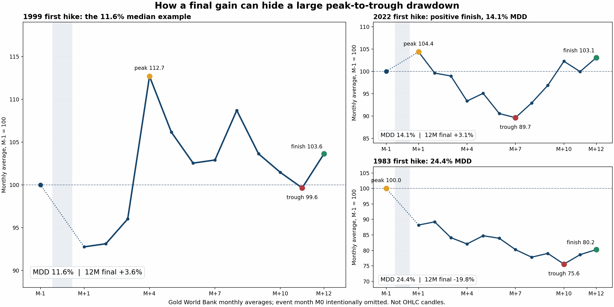

# 11.6% 到底跌在哪里？黄金首次加息后的月度路径

更新：2026-09-27 悉尼。由 [004 已冻结的逐月路径](../fed_cycle_phase_clock_v1/PHASE_PATHS.csv) 直接绘图；[045 固定作图方案](../../research/GOLD_MDD_EXPLAINER_045_SPEC.md) 和 [复现脚本](../../scripts/plot_gold_mdd_explainer_045.py)。图中是世界银行黄金**月均价**、M-1 标准化为 100，M0 加息月份留空；不是黄金期货或外汇经纪商的开高低收 K 线。

## 一眼看懂

**1999 年是刚好落在样本加权中位回撤 11.6% 的那笔实例：**

| 位置 | 相对加息前一月的月均价 | 你看到的变化 |
|---|---:|---|
| 1999-05（基线，M-1） | 100.0 | 把它定为 100。 |
| 1999-10（M+4，12 个月内此前最高点） | 112.7 | 相对基线上涨 12.7%。 |
| 2000-05（M+11，随后最低点） | 99.6 | 从 112.7 跌到 99.6：`(99.6/112.7−1) ≈ −11.6%`。**这是最大回撤**。 |
| 2000-06（M+12，终点） | 103.6 | 与原始基线 100 比，**最后反而约 +3.6%**。 |

上面的 11.6% 是**从之前最高点到之后最低点的路径跌幅**，不是“每次加息后黄金跌 11.6%”，也不是“某一个自然月跌了 11.6%”，更不是“黄金 12 个月最终回报 −11.6%”。004 对每个事件各算一笔最大回撤，再按七个宽泛周期的权重取中位数；共有**十个机械首次加息段，七个宽泛周期**。 [十笔逐事件数据](GOLD_FIRST_HIKE_ALL_TEN.csv)。

同理，**2022** 的黄金从 104.4（月均 M+1 最高）落到 89.7（M+7 谷底），路径回撤约 **14.1%**，最后收在 103.1（终点 **+3.1%**）。**1983** 从基线 100 到 M+10 的 75.6，回撤 **24.4%**，终点 80.2（**−19.8%**）。同一种“首次加息”，走势差别非常大。

## 若要看真正的 K 线

可打开 [TradingView TVC:GOLD 历史图](https://www.tradingview.com/chart/?symbol=TVC%3AGOLD)，切日线/周线，并分别定位 **1999-05 至 2000-06**、**2022-02 至 2023-03**。TradingView 称其黄金历史序列可回溯至 1833 年，但 TVC:GOLD/交易商 XAUUSD 的历史 OHLC、复权/拼接与数据商口径**不是本研究的世界银行月均价**，因此图上极值或回撤绝不要求恰好等于 11.6%。不要把此图的日内影线与 004 月均价统计混为一谈；真正日线 K 线按其真实 OHLC 重新计算会得到另一项回撤。

世界银行 [Pink Sheet](https://www.worldbank.org/en/research/commodity-markets) 是现代黄金月度价格源；仓库 [004 source registry](../fed_cycle_phase_clock_v1/SOURCE_REGISTRY.csv) 钉住了 `datasets/gold-prices` 原始提交及 SHA-256。045 使用已提交的衍生逐月路径作图，**不再分发新的原始行情**。逐点重新计算的峰、谷、终点与 004 逐事件 MDD/收益的差均低于 `1e-12`；[045 QC](QC.json) 已通过。
